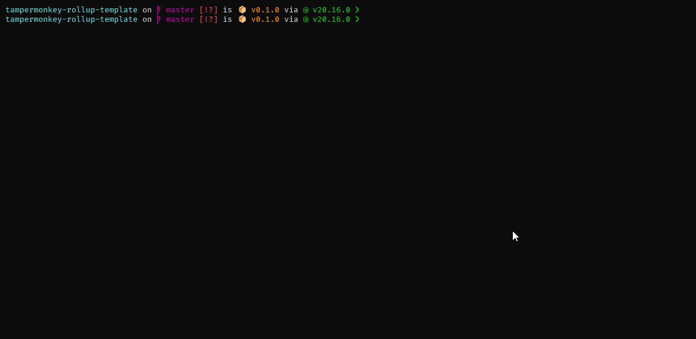

# Tampermonkey Template - with Typescript & Rolldown

Template repo for creating Tampermonkey scripts with Typescript and Rolldown.



## Features ⚡

- [TypeScript](https://www.typescriptlang.org)
- [Rolldown](https://rolldown.rs) for bundling
    - Minification
    - Allows use of npm packages
- Patch script for Tampermonkey metadata

## Development 👨‍💻

**Quick start** command:

```bash
git clone https://github.com/hmerritt/tampermonkey-rollup-template && cd tampermonkey-rollup-template && yarn && yarn dev
```

To get started with this template, follow these steps:

1. Clone the repository
2. Edit `package.json` to set basic script metadata
3. Edit `build/build-patch.ts` to set any extra metadata
4. `yarn install` to install dependencies
5. `yarn dev` to start the watcher for development server
6. `yarn build` for final build
